As all good things must come to an end I decided to stop posting my album charts here, it's been a nice ride though!
 
 
_Updates on my monthly plays from Lastfm._

## August 2023

A month of hot weather, lots of programming, yelling at the screen and classic hard bop jazz. What a ride. Glad the Autumn is coming, my favourite season.

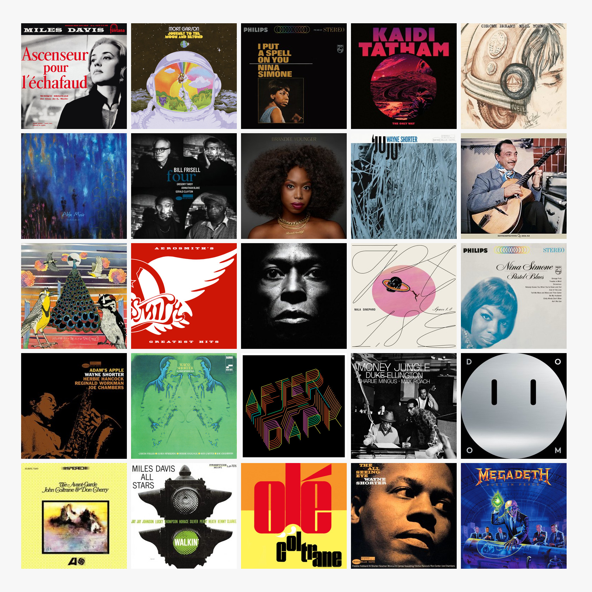

1\. Miles Davis - _Ascenseur Pour L'échafaud_ 
2\. Mort Garson - _Journey to the Moon and Beyond_ 
3\. Nina Simone - _I Put a Spell on You_ 
4\. Kaidi Tatham - _The Only Way_ 
5\. Neil Young - _Chrome Dreams_ 
6\. Alfa Mist - _Variables_ 
7\. Bill Frisell - _Four_ 
8\. Brandee Younger - _Brand New Life_ 
9\. Wayne Shorter - _JuJu_ 
10\. Django Reinhardt - _Retrospective 1934-1953_ 
11\. Jaime Branch - _Fly or Die Fly or Die Fly or Die ((world war))_ 
12\. Aerosmith - _Greatest Hits_ 
13\. Miles Davis - _Tutu_ 
14\. Nala Sinephro - _SPACE 1.8_ 
15\. Nina Simone - _Pastel Blues_ 
16\. Wayne Shorter - _Adam's Apple_ 
17\. Wayne Shorter - _Schizophrenia_ 
18\. Bill Brewster - _Late Night Tales Presents: After Dark - Vespertine_ 
19\. Duke Ellington - _Money Jungle_ 
20\. Bonnacons of Doom - _Bonnacons of Doom_ 
21\. John Coltrane - _The Avant-Garde_ 
22\. Miles Davis - _Wlakin'_ 
23\. John Coltrane - _Olé Coltrane_ 
24\. Wayne Shorter - _The All Seeing Eye_ 
25\. Megadeth - _Rust in Peace_ 

## July 2023

A somewhat slow and fast month at the same time for me, not my brightest moment. Miles helped me a lot through it, though. And quite a few new jazz releases. Most of all, one of my favourite artists in recent times just released another good record, Kaidi Tatham - The Only Way. My summer's banger without a doubt.

[lastfm Albums Chart July 2023](./_images/2023-01-08-monthly-lastfm-albums-charts/2023_07_July_lastfm_chart.jpg)

1\. Kaidi Tatham - _The Only Way_ 
2\. Alfa Mist - _Variables_ 
3\. Miles Davis - _Birth of the Cool_ 
4\. Ricardo Dias Gomes - _Muito Sol_ 
5\. Meshell Ndegeocello - _The Omnichord Real Book_ 
6\. Bill Evans Trio - _Waltz for Debby_ 
7\. Nubya Garcia - _Source_ 
8\. Pat Metheny - _Dream Box_ 
9\. Tony Allen - _Tony Allen JID018_ 
10\. Miles Davis - _Sorcerer_ 
11\. Orrin Evans - _The Red Door_ 
12\. Overmono - _Good Lies_ 
13\. James Holden - _Imagine This Is A High Dimensional Space of All Possibilities_ 
14\. Kaidi Tatham - _Don't Rush the Process_ 
15\. Kode9 - _Escapology_ 
16\. Miles Davis Quintet - _Workin' With The Miles Davis Quintet_ 
17\. The Human Abstract - _Nocturne_ 
18\. James Ellis Ford - _The Hum_ 
19\. Bill Evans Trio - _On a Friday Evening_ 
20\. Yussef Kamal - _Black Focus_ 
21\. Bill Evans Trio - _Portrait in Jazz_ 
22\. Gilroy Mere - _Gilden Gate_ 
23\. Nina Simone - _You've Got to Learn_ 
24\. Speakers Corner Quartet - _Further Out Than The Edge_ 
25\. Miles Davis - _Miles Smiles_ 

## June 2023

Half of this month of June was spent in Italy on holiday, I mostly listened to music saved locally on my iPhone, so not much new stuff.

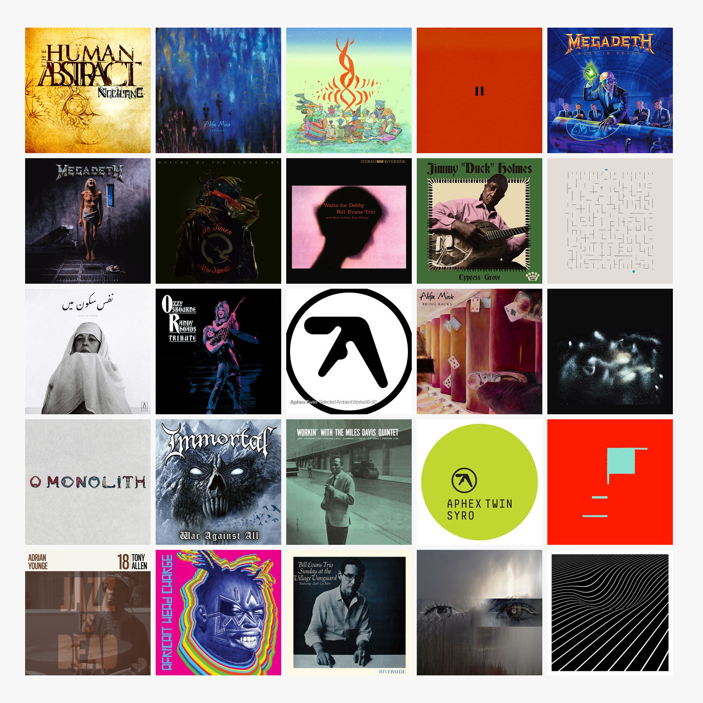

1\. The Human Abstract - _Nocturne_ 
2\. Alfa Mist - _Variables_ 
3\. James Holden - _Imagine This Is A High Dimensional Space of All Possibilities_ 
4\. SAULT - _11_ 
5\. Megadeth - _Rust in Peace_ 
6\. Megadeth - _Countdown to Exxtinction_ 
7\. Queens of the Stone Age - _In Times New Roman..._ 
8\. Bill Evans Trio - _Waltz for Debby_ 
9\. Jimmy "Duck" Holmes - _Cypress Grove_ 
10\. Jasmine Myra - _Horizons_ 
11\. Jaubi - _Nafs at Peace_ 
12\. Ozzy Osbourne - _Tribute_ 
13\. Aphex Twin - _Selected Ambient Works 85-92_ 
14\. Alfa Mist - _Bring Backs_ 
15\. James Ellis Ford - _The Hum_ 
16\. Squid - _O Monolith_ 
17\. Immortal - _War Against All_ 
18\. Miles Davis Quintet - _Workin' With The Miles Davis Quintet_ 
19\. Aphex Twin - _Syro_ 
20\. brainwaltzera - _ITSAME_ 
21\. Tony Allen - _Tony Allen JID018_ 
22\. African Head Charge - _A Trip To Bolgatanga_ 
23\. Bill Evans Trio - _Sunday At The Village Vanguard_ 
24\. Caterina Barbieri - _Ecstatic Computation_ 
25\. 36 - _The Lower Lights_ 

## May 2023

Finally the sun is here. Time for some Megadeth I guess. And jazz, lots of jazz.

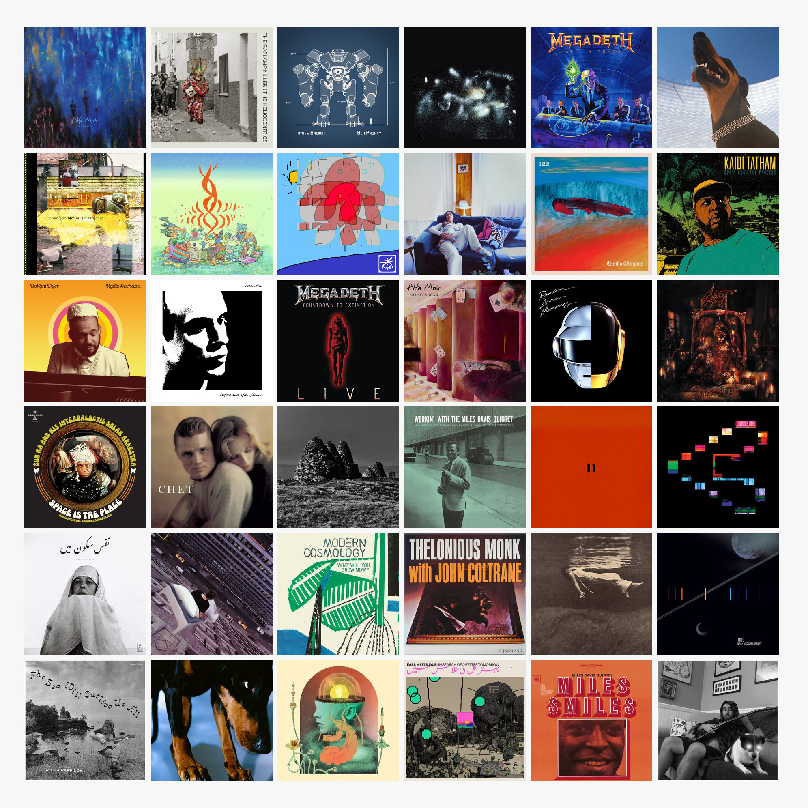

1\. Alfa Mist - _Variables_ 
2\. The Gaslamp Killer - _Legna_ 
3\. Ben Prunty - _Into The Breach Soundtrack_ 
4\. James Ellis Ford - _The Hum_ 
5\. Megadeth - _Rust in Peace_ 
6\. Overmono - _Good Lies_ 
7\. Brian Eno - _Film Music 1976-2020_ 
8\. James Holden - _Imagine This Is A High Dimensional Space of All Possibilities_ 
9\. きゃべつ - _Bye Bye_ 
10\. Cleo Sol - _Mother_ 
11\. Combo Chimbita - _IRE_ 
12\. Kaidi Tatham - _Don't Rush The Process_ 
13\. Bokani Dyer - _Radio Sechaba_ 
14\. Brian Eno - _Before and After Science_ 
15\. Megadeth - _Countdown To Exxtinction: Live_ 
16\. Alfa Mist - _Bring Backs_ 
17\. Daft Punk - _Random Access Memories_ 
18\. Sadist - _Firescorched_ 
19\. Sun Ra Arkestra - _Sun Ra & His Intergalactic Solar Arkestra: Space Is The Place (Music From The Original Soundtrack)_ 
20\. Chet Baker - _Chet_ 
21\. Craven Faults - _Standers_ 
22\. Miles Davis Quintet - _Workin' With The Miles Davis Quintet_ 
23\. SAULT - _11_ 
24\. Squarepusher - _Be Up a Hello_ 
25\. Jaubi - _Nafs at Peace_ 
26\. Megadeth - _Rude Awakening_ 
27\. Modern Cosmology - _What Will You Grow Now?_ 
28\. Thelonious Monk - _Thelonious Monk with John Coltrane_ 
29\. Bill Evans - _Undercurrent_ 
30\. Dodheimsgard - _Black Medium Current_ 
31\. Misha Panfilov - _The Sea Will Outlive Us All_ 
32\. Overmono - _Cash Romantic_ 
33\. Salami Rose Joe Louis - _Akousmatikous_ 
34\. EABS / Jaubi - _In Search of a Better Tomorrow_ 
35\. Miles Davis - _Miles Smiles_ 
36\. Mother Iguana - _Eyeball Planet_ 

## April 2023

A mix of old nostalgia stuff and some new spins in April as well. The new Metallica is awful as usual.

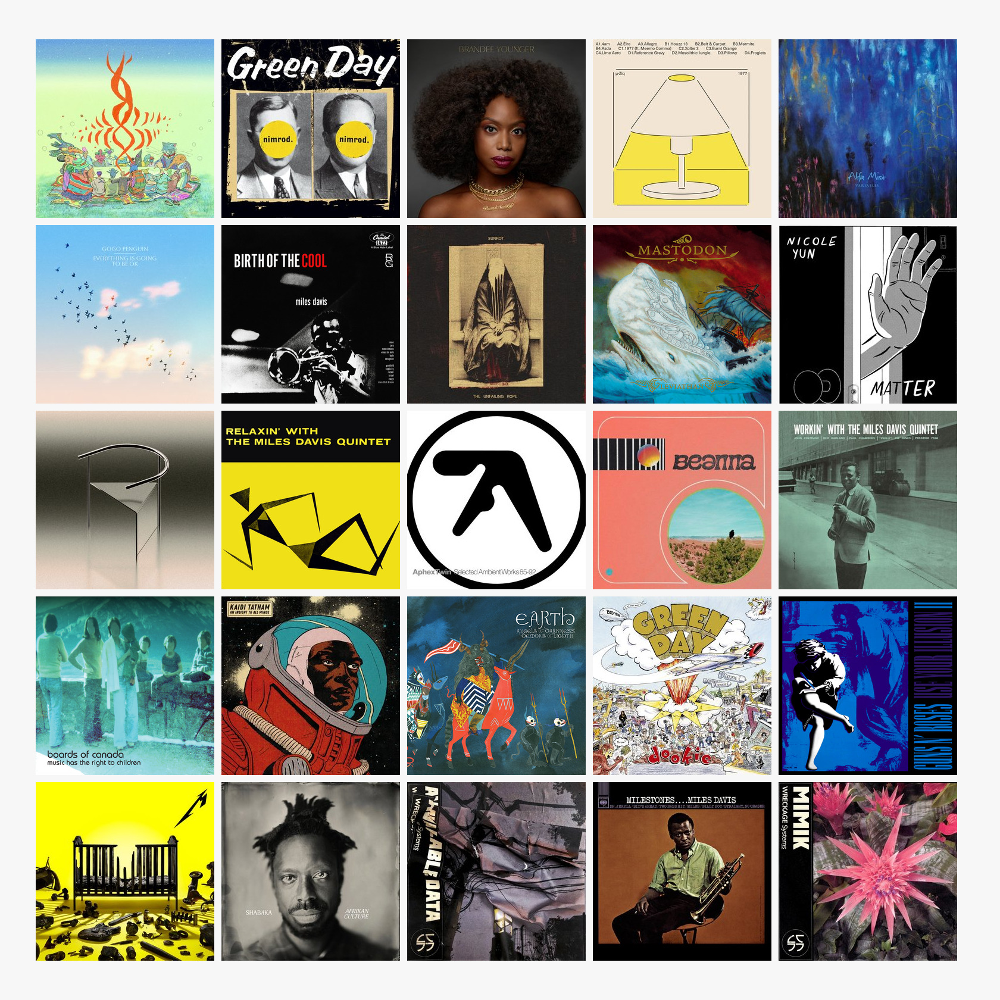

1\. James Holden - _Imagine This Is A High Dimensional Space of All Possibilities_ 
2\. Green Day - _Nimrod_ 
3\. Brandee Younger - _Brand New Life_ 
4\. µ-Ziq - _1977_ 
5\. Alfa Mist - _Variables_ 
6\. GoGo Penguin - _Everything Is Going to Be OK_ 
7\. Miles Davis - _Birth of the Cool_ 
8\. Sunrot - _The Unfailing Rope_ 
9\. Mastodon - _Leviathan_ 
10\. Nicole Yun - _Matter_ 
11\. Ital Tek - _Timeproof_ 
12\. Miles Davis - _Relaxin' With The Miles Davis Quintet_ 
13\. Aphex Twin - _Selected Ambient Works 85-92_ 
14\. mejiwahn - _Beanna_ 
15\. Miles Davis Quintet - _Workin' With The Miles Davis Quintet_ 
16\. Boards of Canada - _Music Has the Right to Children_ 
17\. Kaidi Tatham - _An Insight To ALl Minds_ 
18\. Earth - _Angels of Darkness, Demons of Light II_ 
19\. Green Day - _Dookie_ 
20\. Guns N' Roses - _Use Your Illusion II_ 
21\. Metallica - _72 Seasons_ 
22\. Shabaka - _Afrikan Culture_ 
23\. 65daysofstatic - _Available Data_ 
24\. Miles Davis - _Milestones_ 
25\. 65daysofstatic - _Mimik_ 

## March 2023

This month again went to show off my usual mix of jazz/metal/electronic/videogames/random stuff. AKA I'm not sure where to go but I go there with style. Also, the spring still looks like a distant mirage over here.

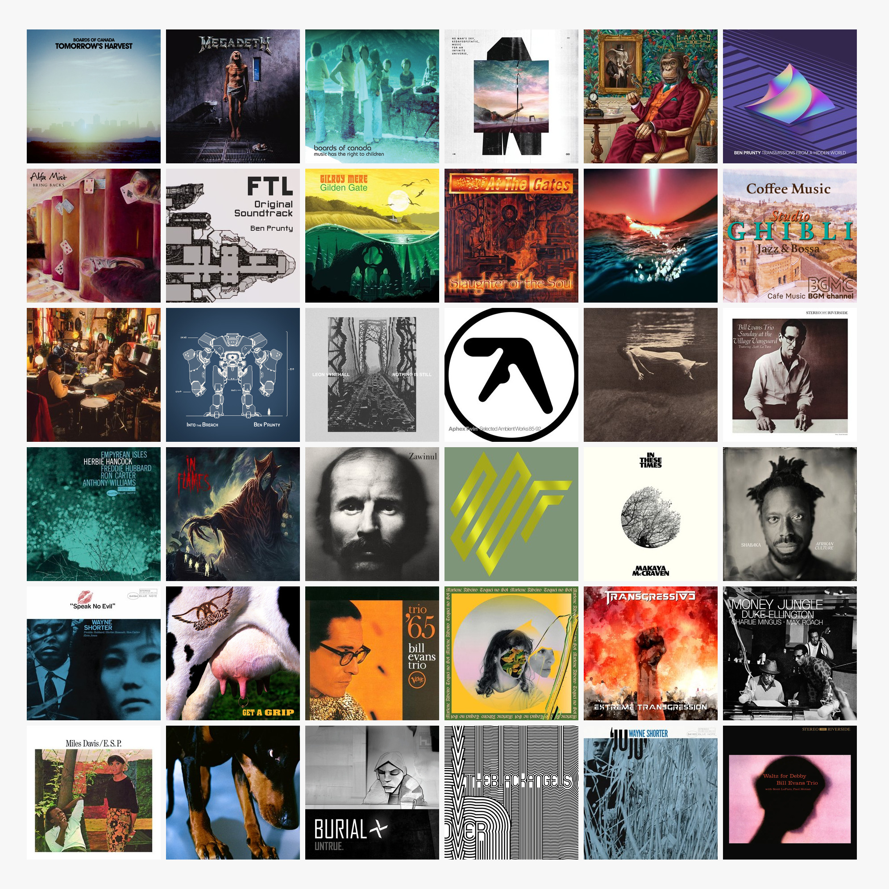

1\. Boards of Canada - _Tomorrow's Harvest_ 
2\. Megadeth - _Countdown to Extinction_ 
3\. Boards of Canada - _Music Has the Right to Children_ 
4\. 65daysofstatic - _No Man's Sky: Music for an Infinite Universe_ 
5\. Haken - _Fauna_ 
6\. Ben Prunty - _Transmission from a Hidden World_ 
7\. Alfa Mist - _Bring Backs_ 
8\. Ben Prunty - _FTL_ 
9\. Gilroy Mere - _Gilden Gate_ 
10\. At the Gates - _Slaughter of the Soul_ 
11\. Bonobo - _Fragments_ 
12\. Cafe Music BGM channel - _Coffee Music ~Studio Ghibli Jazz & Bossa_ 
13\. Ezra Collective - _Where I'm Meant to Be_ 
14\. Ben Prunty - _Into the Breach Soundtrack_ 
15\. Leon Vynehall - _Nothing is Still_ 
16\. Aphex Twin - _Selected Ambient Works 85-92_ 
17\. Bill Evans - _Undercurrent_ 
18\. Bill Evans Trio - _Sunday At The Village Vanguard_ 
19\. Herbie Hancock - _Empyrean Isles_ 
20\. In Flames - _Foregone_ 
21\. Joe Zawinul - _Zawinul_ 
22\. Luke Vibert - _Machine Funk_ 
23\. Makaya McCraven - _In These Times_ 
24\. Shabaka - _Afrikan Culture_ 
25\. Wayne Shorter - _Speak No Evil_ 
26\. Aerosmith - _Get a Grip_ 
27\. Bill Evans Trio - _Trio '65_ 
28\. Marlene Ribeiro - _Toquei No Sol_ 
29\. Transgressive - _Extreme Transgression_ 
30\. Duke Ellington - _Money Jungle_ 
31\. Miles Davis - _E.S.P._ 
32\. Overmono - _Cash Romantic_ 
33\. Burial - _Untrue_ 
34\. The Black Angels - _Passover_ 
35\. Wayne Shorter - _Juju_ 
36\. Bill Evans Trio - _Waltz for Debby_ 

## February 2023

It was a videogame 8-bit soundtracks kind of month. And also the month I discovered _Woods of Ypress_ and got myself into a doom hole. Fair enough. Let's move on with the Spring, please.

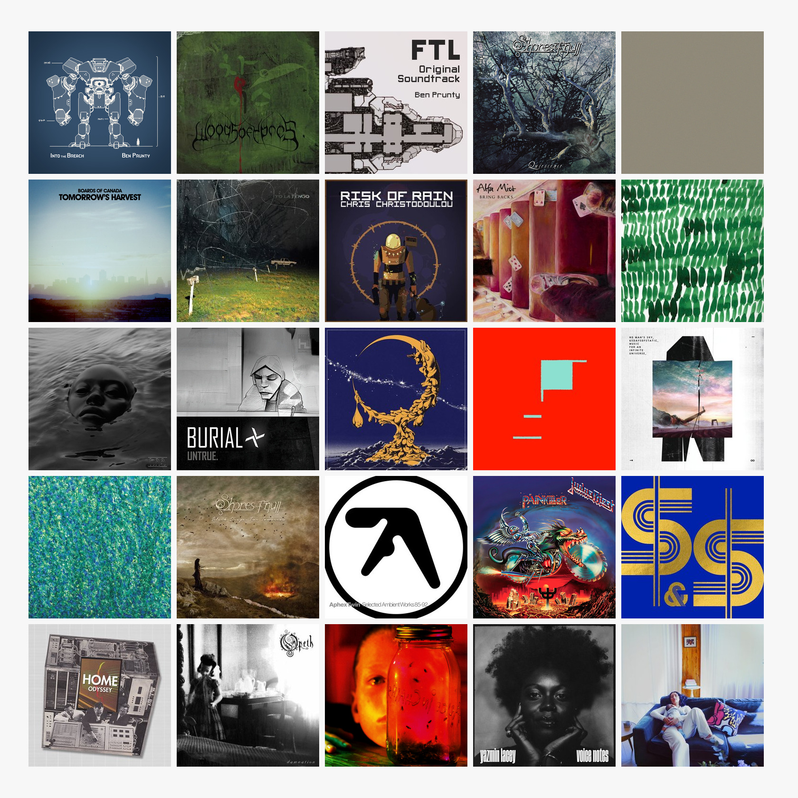

1\. Ben Prunty - _Into the Breach Soundtrack_ 
2\. Woods of Ypress - _Woods 4: The Green Album_ 
3\. Ben Prunty - _FTL Soundtrack_ 
4\. Shores of Null - _Quiescence_ 
5\. Autechre - _Tri Repetae_ 
6\. Boards of Canada - _Tomorrow's Harvest_ 
7\. Yo La Tengo - _This Stupid World_ 
8\. Chris Christodolou - _Risk of Rain Soundtrack_ 
9\. Alfa Mist - _Bring Backs_ 
10\. Faten Kanaan - _Afterpoem_ 
11\. Kelela - _Raven_ 
12\. Burial - _Untrue_ 
13\. Pigs pigs pigs pigs pigs pigs pigs - _Land of Sleeper_ 
14\. brainwaltzera - _ITSAME_ 
15\. 65daysofstatic - _No Man's Sky: Music for an Infinite Universe_ 
16\. Marco Zenker - _Channel Balance_ 
17\. Shores of Null - _Black Drapes For Toorrow_ 
18\. Aphex Twin - _Selected Ambient Works 85-92_ 
19\. Judas Priest - _Painkiller_ 
20\. Shit and Shine - _New Confusion_ 
21\. Home - _Odyssey_ 
22\. Opeth - _Damnation_ 
23\. Alice in Chains - _Jar of Flies_ 
24\. Yazmin Lacey - _Voice Notes_ 
25\. Cleo Sol - _Mother_ 

## January 2023

This month as well has been hectic music-wise. Turns out when I'm studying I have less mental energy to porper listening to music. When I code it's just a background. Still some blasts from teh past nonetheless. And very few new albums. A slow starting year indeed.

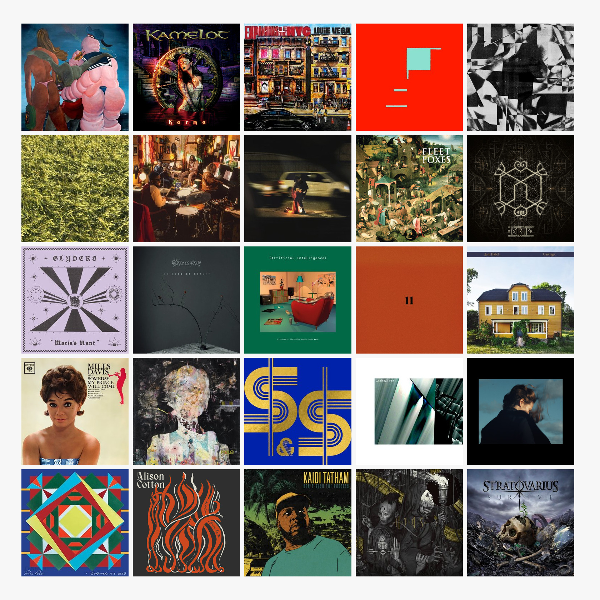

1\. Hudson Mohawke - _Cry Sugar_ 
2\. Kamelot - _Karma_ 
3\. Louie Vega - _Expansions In The NYC_ 
4\. brainwaltzera - _ITSAME_ 
5\. 99LETTERS - _Kaibou Zukan_ 
6\. Skee Mask - _Pool_ 
7\. Ezra Collective - _Where I'm Meant To Be_ 
8\. Rachika Nayar - _Heaven Come Crashing_ 
9\. Fleet Foxes - _Fleet Foxes_ 
10\. Heilung - _Drif_ 
11\. Glyders - _Maria's Hunt_ 
12\. Shores of Null - _The Loss of Beauty_ 
13\. Various Artists - _Artificial Intelligence_ 
14\. Sault - _11_ 
15\. Juni Habel - _Carvings_ 
16\. Miles Davis - _Someday My Prince Will Come_ 
17\. Pole - _Tempus_ 
18\. Shit & Shine - _New Confusion_ 
19\. Autechre - _Confield_ 
20\. Hania Rani - _Esja_ 
21\. Rich Ruth - _I Survived, It's Over_ 
22\. Alison Cotton - _The Portrait You Painted of Me_ 
23\. Kaidi Tatham - _Don't Rush The Process_ 
24\. Otus - _Torch_ 
25\. Stratovarius - _Survive_ 

## December 2022

December has been a weird one as I've been traveling and away from my desktop (and music gear). Lots of throw backs into power metal, 90s music, mixed with relistens of this year's favourites. To a 2023 full of good music.

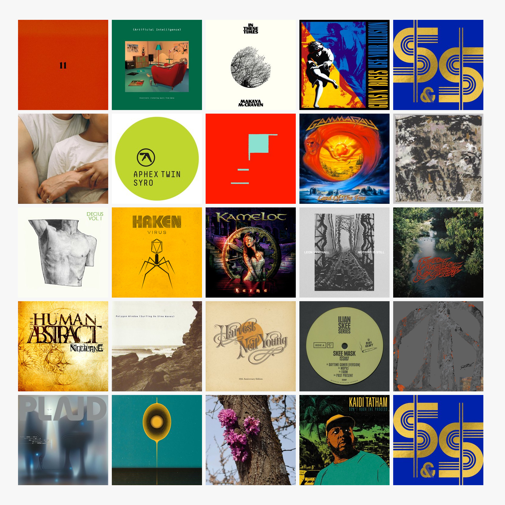

1\. SAULT - _11_  
2\. Various Artists - _Artificial Intelligence_  
3\. Makaya McCraven - _In These Times_  
4\. Guns N' Roses - _Use Your Illusion_  
5\. Shit and Shine - _New Confusion_  
6\. Duval Timothy - _Help_  
7\. Aphex Twin - _Syro_  
8\. brainwaltzera - _ITSAME_  
9\. Gamma Ray - _Land of the Free (Anniversary Edition)_  
10\. Loraine James - _Building Something Beautiful For Me_  
11\. Decius - _Decius Vol. I_  
12\. Haken - _Virus_  
13\. Kamelot - _Karma_  
14\. Leon Vynehall - _Nothing Is Still_  
15\. Surprise Chef - _Education & Recreation_  
16\. The Human Abstract - _Nocturne_  
17\. Aphex Twin - _Surfing On Sine Waves_  
18\. Neil Young - _Harvest (50th Anniversary Edition)_  
19\. Skee Mask - _ISS007_  
20\. Huerco S. - _Plonk_  
21\. Plaid - _Feorm Falorx_  
22\. The Utopia Strong - _International Treasure_ 
23\. Duval Timothy - _Meeting with a Judas Tree_ 
24\. Kaidi Tatham - _Don't Rush The Process_ 
25\. Shit & Shine - _New Consusion (duplicate, thanks Lastfm)_ 

## November 2022

It's definitely been a SAULT month, considering they released 5 albums at the same time and they're all good, it was quite predictable. This month almost no jazz, with the exception of Bill Frisell (a delightful album, but when did he made a bad one anyway?) and a re-listen of the latest Sun Ra Arkestra which is growing on me. Lots of electronica that kept me company during this cold month of studying and working at my computer most days (and nights). Some 90s nostalgia for good measure.

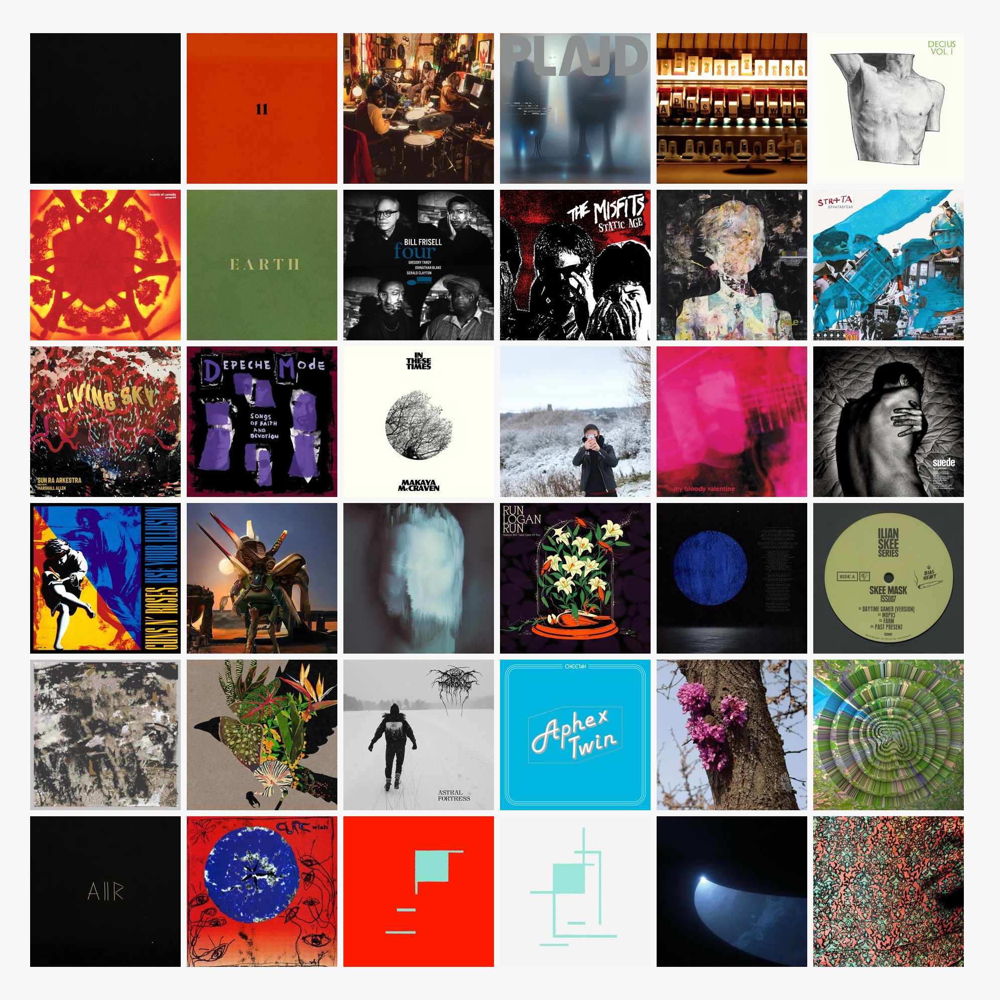

1\. SAULT - _UNTITLED (God)_  
2\. SAULT - _11_  
3\. Ezra Collective - _Where I'm Meant To Be_  
4\. Plaid - _Feorm Falorx_  
5\. Aphex Twin - _Drukqs_  
6\. Decius - _Decius Vol. I_  
7\. Boards of Canada - _Geogaddi_  
8\. SAULT - _Earth_  
9\. Bill Frisell - _Four_  
10\. Misfits - _Static Age_  
11\. Pole - _Tempus_  
12\. STR4TA - _STR4TASFEAR_  
13\. Sun Ra Arkestra - _Living Sky_  
14\. Depeche Mode - _Songs of Faith and Devotion_  
15\. Makaya McCraven - _In These Times_  
16\. Martha - _PLeasee Don't Take Me Back_  
17\. My Bloody Valentine - _Loveless_  
18\. Suede - _Autofiction_  
19\. Guns N' Roses - _Use Your Illusion_  
20\. Röyksopp - _Profound Mysteries III_  
21\. Ólafur Arnalds - _some kind of peace — piano reworks_  
22\. Run Logan Run - _Nature Will Take Care Of You_ 
23\. SAULT - _Today & Tomorrow_ 
24\. Skee Mask - _ISS007_ 
25\. Loraine James - _Building Something Beautiful For Me_ 
26\. Coldcut & Mixmaster Morris - _@0_ 
27\. Darkthrone - _Astral Fortress_ 
28\. Aphex Twin - _Cheetah EP_ 
29\. Duval Timothy - _Meeting with a Judas Tree_ 
30\. Aphex Twin - _Collapse EP_ 
31\. SAULT - _AIIR_ 
32\. The Cure - _Wish_ 
33\. brainwaltzera - _ITSAME_ 
34\. brainwaltzera - _Medal Headz [G.B.D.F] - EP_ 
35\. Floating Points - _Someone Close_ 
36\. Jaimie Branch - _FLY or DIE LIVE_ 

## October 2022

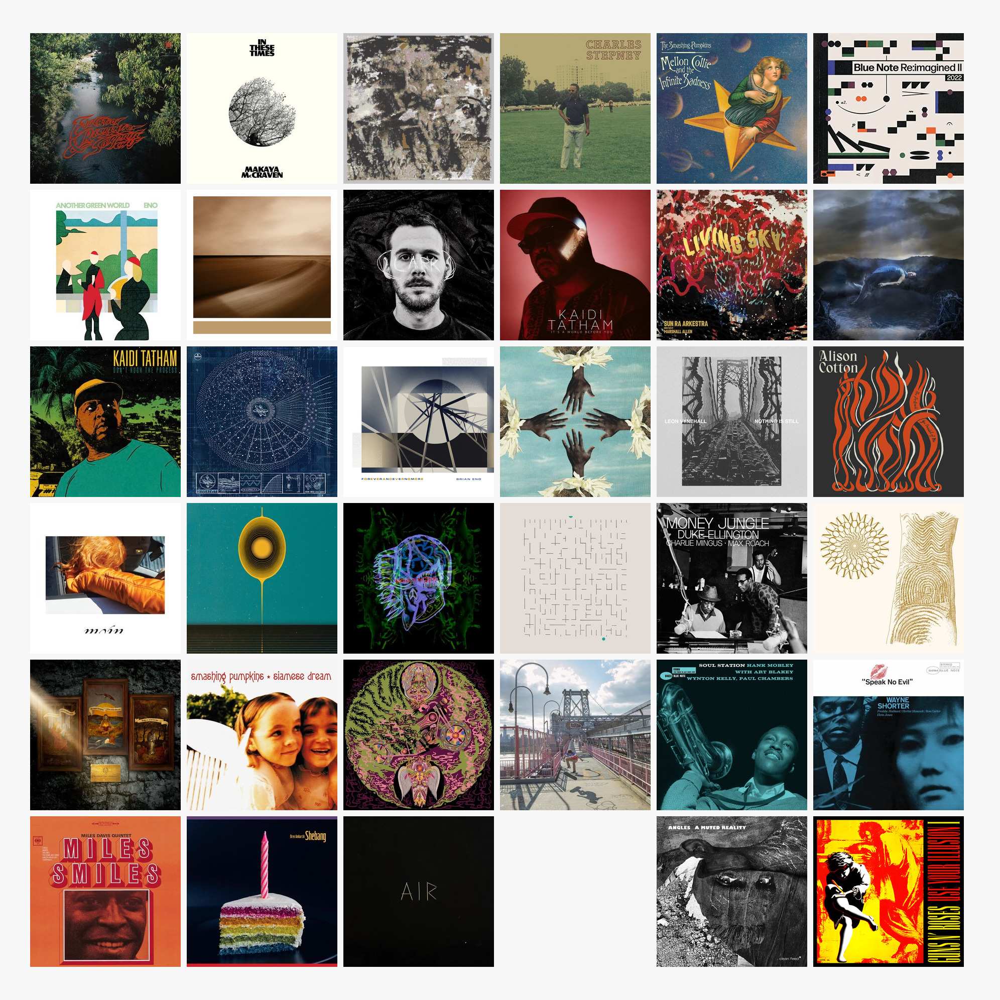

1\. Surprise Chef - _Education & Recreation_  
2\. Makaya McCraven - _In These Times_  
3\. Loraine James - _Building Something Beautiful For Me_  
4\. Charles Stepney - _Step On Step_  
5\. The Smashing Pumpkins - _Mellon Collie and the Infinite Sadness_  
6\. Various Artists - _Blue Note Re:imagined II_  
7\. Brian Eno - _Another Green World_  
8\. Brian Eno - _Small Craft on a Milk Sea_  
9\. Clark - _05-10_  
10\. Kaidi Tatham - _It's a World Before You_  
11\. Sun Ra Arkestra - _Living Sky_  
12\. Caterina Barbieri - _Spirit Exit_  
13\. Kaidi Tatham - _Don't Rush The Process_  
14\. The Comet Is Coming - _Hyper-Dimensional Expansion Beam_  
15\. Brian Eno - _FOREVERANDEVERNOMORE_  
16\. Kokoroko - _Could We Be More_  
17\. Leon Vynehall - _Nothing Is Still_  
18\. Alison Cotton - _The Portrait You Painted of Me_  
19\. Moin - _Paste_  
20\. The Utopia Strong - _International Treasure_  
21\. All Them Witches - _Nothing as the Ideal_  
22\. Jasmine Myra - _Horizons_ 
23\. Duke Ellington - _Money Jungle_ 
24\. Moundabout - _Flowers Rot, Bring me Stones_ 
25\. Opeth - _Pale Communion_ 
26\. The Smashing Pumpkins - _Siamese Dream_ 
27\. Witch - _Witch_ 
28\. Hagop Tchaparian - _Bolts_ 
29\. Hank Mobley - _Soul Station_ 
30\. Wayne Shorter - _Speak No Evil_ 
31\. Miles Davis - _Miles Smiles_ 
32\. Oren Ambarchi - _Shebang_ 
33\. SAULT - _Air_ 
34\. STR4TA - _STR4TASFEAR_ 
35\. Angles - _A Muted Reality_ 
36\. Guns N' Roses - _Use Your Illusion I_ 

## September 2022

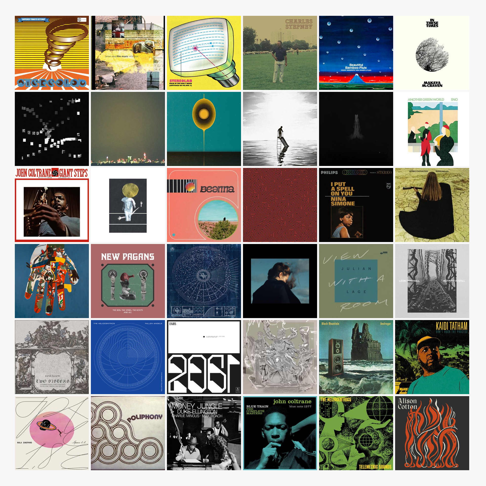

1\. Stereolab - _Emperor Tomato Ketchup_  
2\. Brian Eno - _Film Music 1976 ~ 2020_  
3\. Stereolab - _Pulse Of The Early Brain [Switched On Volume 5]_  
4\. Charles Stepney - _Step On Step_  
5\. Hozan Yamamoto - _Beautiful Bamboo-Flute_  
6\. Makaya McCraven - _In These Times_  
7\. Sunda Arc - _Tides_  
8\. Eliza - _A Sky Without Stars_  
9\. The Utopia Strong - _International Treasure_  
10\. Clark - _Playground In A Lake_  
11\. Sault - _UNTITLED (Rise)_  
12\. Brian Eno - _Another Green World_  
13\. John Coltrane - _Giant Steps_  
14\. The Vernon Spring - _A Plane Over Woods_  
15\. mejiwahn - _Beanna_  
16\. The Black Angels - _Wilderness of Mirrors_  
17\. Nina Simone - _I Put a Spell on You_  
18\. Shawn Phillips - _Second Contribution_  
19\. Hot Chip - _Freakout/Release_  
20\. New Pagans - _The Seed, The Vessel, The Roots and All_  
21\. The Comet Is Coming - _Hyper-Dimensional Expansion Beam_  
22\. Hania Rani - _Esja_ 
23\. Julian Lage - _View With A Room_ 
24\. Leon Vynehall - _Nothing Is Still_ 
25\. Sarah Davachi - _Two Sisters_ 
26\. The Heliocentrics - _Fallen Angels (the Singles Collection)_ 
27\. EABS - _2061_ 
28\. Wojciech Rusin - _Syphon_ 
29\. Black Mountain - _Destroyer_ 
30\. Kaidi Tatham - _Don't Rush The Process_ 
31\. Nala Sinephro - _SPACE 1.8_ 
32\. Poliphony - _Poliphony_ 
33\. Duke Ellington - _Money Jungle_ 
34\. John Coltrane - _Blue Train: The Complete Masters_ 
35\. The Heliocentrics - _Telemetric Sounds_ 
36\. Alison Cotton - _The Portrait You Painted of Me_ 

## August 2022

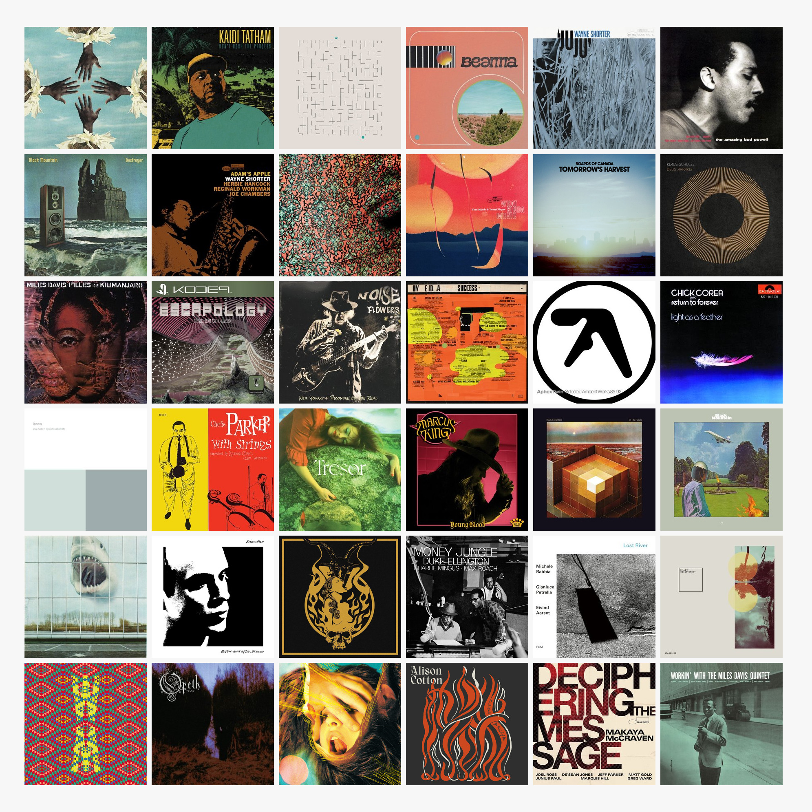

1\. Kokoroko - _Could We Be More_  
2\. Kaidi Tatham - _Don't Rush The Process_  
3\. Jasmine Myra - _Horizons_  
4\. mejiwahn - _Beanna_  
5\. Wayne Shorter - _JuJu_  
6\. Bud Powell - _The Amazing Bud Powell: Vol. 1_  
7\. Black Mountain - _Destroyer_  
8\. Wayne Shorter - _Adam's Apple_  
9\. Jaimie Branch - _FLY or DIE LIVE_  
10\. Tom Misch - _What Kinda Music_  
11\. Boards of Canada - _Tomorrow's Harvest_  
12\. Klaus Schulze - _Deus Arrakis_  
13\. Miles Davis - _Filles De Kilimanjaro_  
14\. Kode9 - _Escapology_  
15\. Neil Young - _NOISE AND FLOWERS_  
16\. Oneida - _Success_  
17\. Aphex Twin - _Selected Ambient Works 85-92_  
18\. Chick Corea - _Light As A Feather_  
19\. Alva Noto - _Insen (Remaster)_  
20\. Charlie Parker - _Charlie Parker With Strings_  
21\. Gwenno - _Tresor_  
22\. Marcus King - _Young Blood_ 
23\. Black Mountain - _In the Future_ 
24\. Black Mountain - _IV_ 
25\. Black Mountain - _Wilderness Heart_ 
26\. Brian Eno - _Before and After Science_ 
27\. Devil - _Time to Repent_ 
28\. Duke Ellington - _Money Jungle_ 
29\. MICHELE RABBIA - _Lost River_ 
30\. Billow Observatory - _Stareside_ 
31\. Goat - _World Music_ 
32\. Opeth - _My Arms, Your Hearse_ 
33\. The Flaming Lips - _Embryonic_ 
34\. Alison Cotton - _The Portrait You Painted of Me_ 
35\. Makaya McCraven - _Deciphering The Message_ 
36\. Miles Davis Quintet - _Workin' With The Miles Davis Quintet_ 
