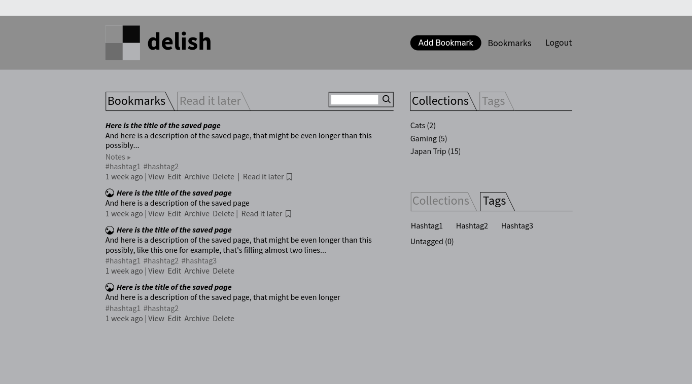

## Intro

As I'm building my web development portfolio I decided to blog about what I'm doing while I'm doing it, also known as building in public.

## What

My Capstone project for [Harvard's CS50w](https://cs50.harvard.edu/web/2020/) was a bookmarks saving web application built with Django and vanilla JavaScript. It was very labour intensive, especially the front-end, which, against all odds and internet memes, made me really appreciate the existence of JavaScript frameworks.
You can have a look at my presentation of the app here: https://www.youtube.com/watch?v=Drs3QUh3-XY.

## Why

For academic honesty reasons I can't share publicly the source code of my final project, that would also invalidate my [certifications](https://credentials.edx.org/credentials/62bff0629c59455da7839cb5a1fd213f/); and so I decided to rebuild the app from scratch, using my previous experience as a guideline.

## Where

Here's the [GitHub repository](https://github.com/mauromotion/delish-bookmarks) of the project.

I also intend to deploy the app somewhere once is in a working status.

## How

Since building the previous app I've already gained different skills and knowledge, so although the functionalities are going to be mostly the same, the technologies I'm going to use are slightly different. Also, I wanna re-design the UI completely.

### Architecture

I'll stick to [Django](https://www.djangoproject.com/) for the back end which I'll treat simply as an API. For this reason this time I'm not gonna write all the JSON serializers myself in the http responses but I'll use the [Django Rest Framework](https://www.django-rest-framework.org), which is perfect for the job.

For the front end instead, I'll save myself the torture of writing everything in vanilla JavaScript and I'll use this as a way to hone my [ReactJS](https://react.dev/) skills.

I'm not sure about the styling yet, I most probably stick to vanilla CSS, maybe using modules to keep it clean and readable. I'm thinking about using Tailwind as well, but I feel I'm learning much more if I use plain CSS. Tailwind is cool and all, but maybe next time.

### MVP

The idea is to build a minimal app that can be expanded easily in the future with new ideas and functionalities.

As a starting base, the app will let the user:

- Register a new account and login.
- Save a URL as a bookmark.
- Organise the saved bookmarks within "folders" called "collections".
- Organise further with tags.
- Toggle the read-it-later flag for each bookmark.
- Filter the list of bookmarks by collection, tag, read-it-later, unsorted, untagged statuses.

 

The app will also be responsive, for desktop, tablet, and smartphone screens.

### So far

I made some wireframes with [Penpot](https://penpot.app/) to get a better idea mostly of the UX and of what models I need for the database:

This is just a guide and it might change later.

For now I started a new Django project, set it up, created the database models, did a first migration.

Next step will be setting up _Django Rest Framework_ and defining the API end points and routes.

Until the next episode!
