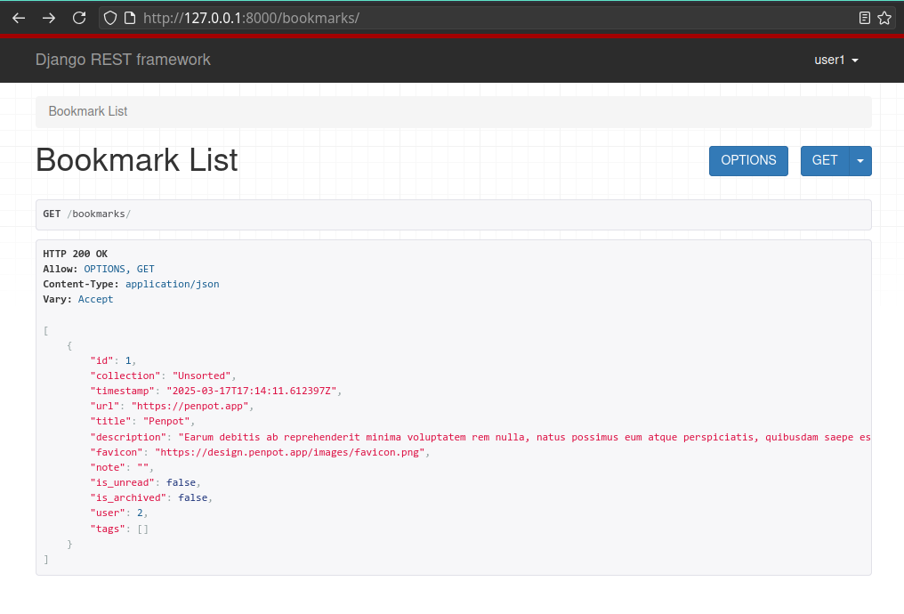

## A journey through time and space

I'm back out of the [Django Rest Framework](https://www.django-rest-framework.org/) rabbit hole, with some new knowledge and some progress.

I thought it was going to be a simple matter of learning a couple of libraries and classes, but it turned out to be much more than what I expected. There are so many layers of abstraction here that I needed to take my time to wrap my mind around them.

[Link to the project's source code](https://github.com/mauromotion/delish-bookmarks).

## Making new friends on the road

It turns out, in hindsight, that using the DRF for my CRUD application here is _definitely_ overkill. But, hey, this is a learning experience after all; and also I can see the potential of the DRF now for bigger scenarios.
Probably, even if I keep building and adding features to this app, it could turn out that the DRF is good solution for scalability.

Anyway, I made this huge deep dive and come out with some new tools and workflows that make me feel much more confident about my back-end skills.

In particular I learned how to:

- Implement a token-based authentication system with DRF.
- Write a script in Django's management/commands to auto-populate the sqlite db for development (huge time saver).
- Make http test requests via an _.http_ file/script with the help of the [Kulala](https://github.com/mistweaverco/kulala.nvim) plugin in Neovim (and the relative [lsp](https://github.com/mistweaverco/kulala-ls) and [linter/formatter](https://github.com/mistweaverco/kulala-fmt)).
- I've been introduced to [django-silk](https://github.com/jazzband/django-silk), great tool for checking performance and debugging eventual bottlenecks in the API (again, overkill for my scope right now but great to know).
- Write a serializer, use it into a view (either function or class-based), add it to the urls as an endpoint. All this with DRF.

## Adventure awaits

Finally, I managed to implement the first endpoint for my app:

I'm now ready to move on, implement all the needed endpoints, and the logic for filling the bookmark model from a user's given URL.

Until the next time!
