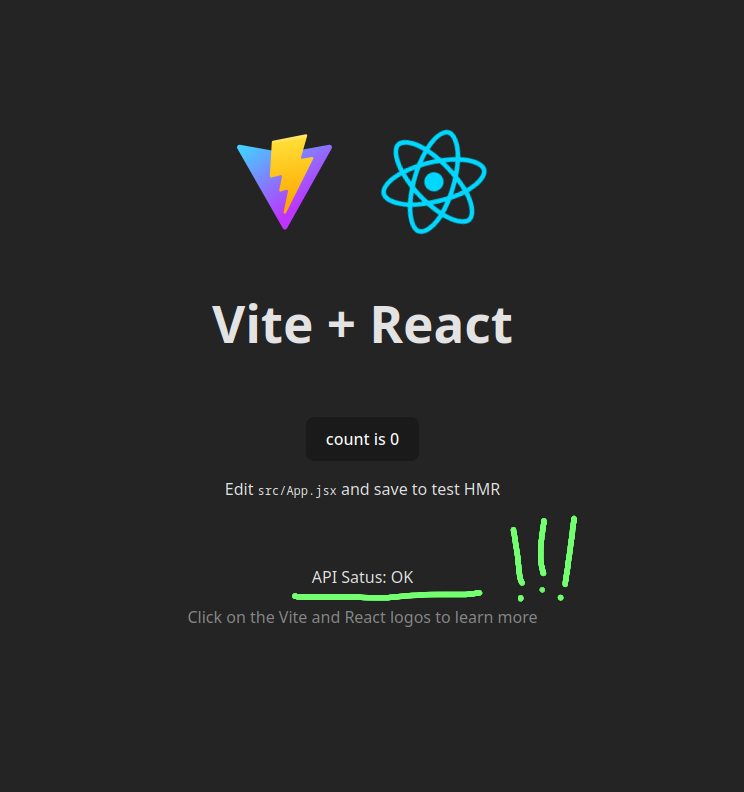

Good progress in the last couple of days!

Now the back-end is in a good state and I can move on my focus to the front-end.

[Link to the project's source code](https://github.com/mauromotion/delish-bookmarks).

## Models, routes, and scraping functions

Now that I've understood the workflow I have to say it's pretty easy to add and customise endpoints with DRF.
I wrote all the models I need (at least for now), with generics classes, and created the corresponding URLs.

I then proceeded to rewrite my scraping functions to be able to get (from a given URL) the existing favicon, title, and possibly a description of the website.
I used a few python libraries for this, specifically [urltitle](https://pypi.org/project/urltitle/) for the titles, [favicon](https://pypi.org/project/favicon/) for the (guess what?) favicons, and a combo of [requests](https://pypi.org/project/requests/) and [beautifulsoup](https://pypi.org/project/beautifulsoup4/) for the descriptions.

## Queuing tasks

Now the first time I developed this application I had one major issue that I didn't solve: sometimes the app will lock up the database, waiting for one of the scraping functions to finish its job.

Now that I'm a wiser man, I went on and looked for a solution to actually have something that I'd describe as "async" behaviour in the back-end for this tasks.
It turns out I learned about schedulers / task queuers, which basically run some specific tasks in their own time and space, and update the database when they're finished (or when I decide).

Brilliant!

After some more digging I found the most minimal (and possibly easy) package for this: [huey](https://huey.readthedocs.io/en/latest/).

Pretty straight forward:

set it up for SQLite database (or whatever you need, even file-system or in-memory!) and use the decorator functions to mark tasks.

Huey then needs to run as a separate service, and it will trigger the functions and then write in the database when it's done fetching the data online. It works like a charm.

## Linking ReactJs and Django

After that was all set up, my main concern was linking ReactJS to the Django back-end.

I knew already that I was going to have to deal with CORS settings in Django, a common issue even when dealing with vanilla JS before; it turns out there is a specific plugin in for this as well: [django-cors-headers](https://pypi.org/project/django-cors-headers/).

And so after installing the package and adding to its whitelist the http addresses of the Django server, the huey connection, and the default Vite development server I was ready to go (hopefully).

## A moment of truth

I decided to have the ReactJS app inside the same directory as the Django project, so that both are in the same version control repository.

I installed [Vite](https://vite.dev/) and launched the scaffolding for a ReactJS template app.
For the root URL of the API I made a simple status check message, and so in ReactJS I went on and added a call to the api-root and displayed the return message on the homepage. It works!!!

Now onto the front-end, wish me luck!
